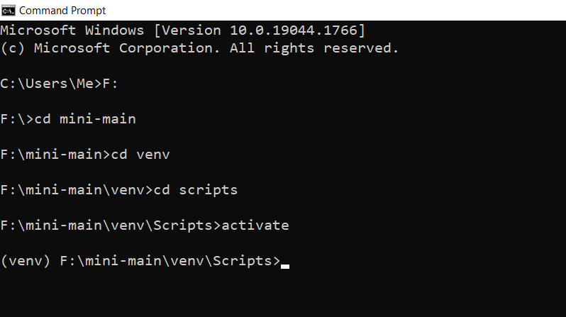
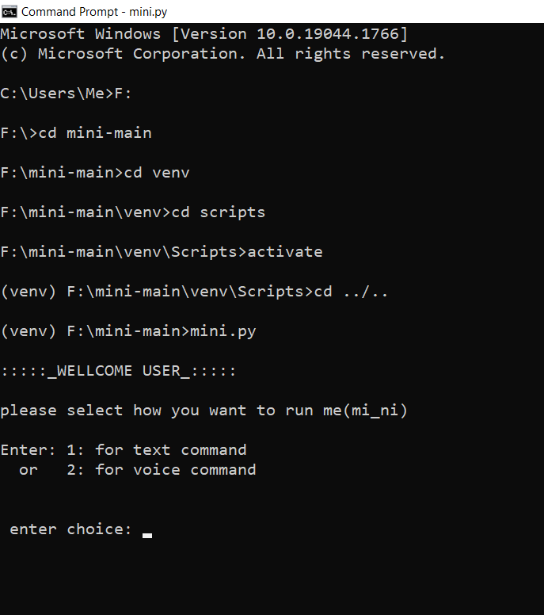
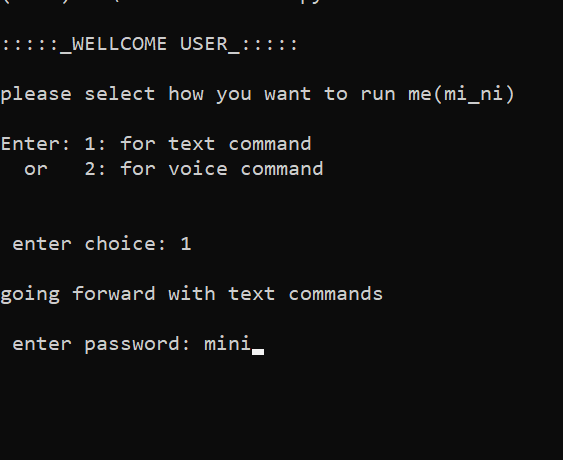
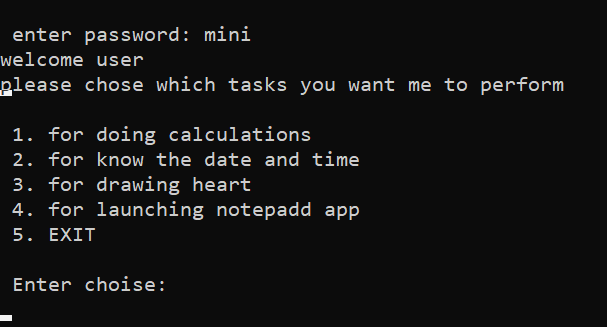

### <h1 align="center">MI_NI</h1>

<h2 align="center"> Project MI_NI 2022</h2>

## project description:

- Project built on the principles of **Artificial Intelligence** and **Machine Learning**
- Project mini is an AI development project, the aim is to build an AI named MINI that is capable of receiving input data/ commands both as a sound command or dynamic input, and function accordingly.
   
- I am designing mini to make the user’s life easy, it will be able to do a various range of tasks from performing simple calculations to finding location, searching any information on the web, help the user perform and follow his/her routine, and lots more.
- It runs and is tested on **_windows_** only as of now.
- Initially, I started working on mini keeping in mind the world famous AI **JARVIS** from marvel movies. It’s my dream to make mini perform like it.
   
  -Thank you for your time.

 
<h2 align="center"> - Tech-Stack:  Python</h2>

**_TO SET UP THE PROJECT_**

- After you download the code file in your local device
- activate the virtual environment
   
  
   
- now use the command **_cd ../.._**
- run the command by typing **_mini.py_** and pressing enter
   
  
   
- enter _1_ to enter **Text command** or enter _2_ for **voice commands**
   
- <h4> when we processed with text input, we decide to run and command the AI with user commands entered from keyword<h4>
   
- you will be asked to enter a password among different wakewords as passwords
  **wakewords = ['mini', 'hey mini', 'hello mini']**
   
  
   
  - 
<h4>these are the functions _mi_ni_ can perform right now</h4>

     
       
     
     
    <h3>And when you enter *2* it initiates the voice control feature, i.e you can use voice commands to run the code and give input </h3>

 

<h2>when the **mini.py** file runs it calls the **assets/textcommandfuntion.py** which further calls the functions from **text-funtion/ funtions** to perform different functions</h2>

## <a href="https://rudranilshil.me/">
 contributed By: Rudranil Shil (rudy) 🔥
</a>
